# ownWiki

Ein selbst gehostetes Wiki für technische Dokumentation und Anleitungen – mit einem PDF-Export, der genau so aussieht wie die Seite im Browser.

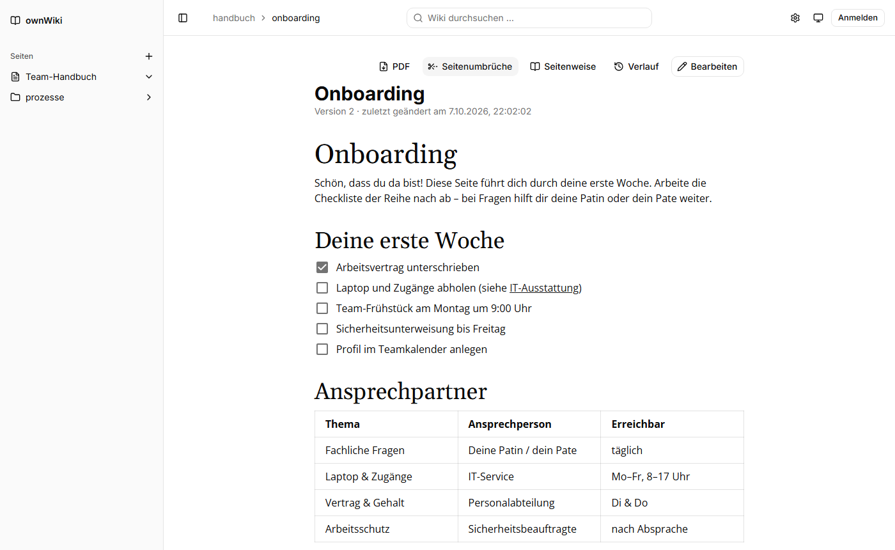

## Funktionen

- **WYSIWYG-Editor auf Markdown-Basis** ([Milkdown Crepe](https://milkdown.dev)): Überschriften, Listen, Checklisten, Tabellen, Code mit Syntax-Hervorhebung, Formeln, Bilder.
- **PDF-Export, der dem Bildschirm entspricht** – einzelne Seiten, ganze Bereiche mit Unterseiten oder das komplette Wiki.
- **Seitenumbruch-Vorschau**: Schon beim Schreiben zeigt eine Linie, wo im PDF eine neue Seite beginnt.
- **Diagramme direkt im Text**: Mermaid, BPMN (bpmn-js) und Excalidraw.
- **Dateien im Text**: hochladen und als Download-Link an der passenden Stelle einfügen.
- **Volltextsuche** über Titel, Pfade und Text aller Seiten, mit hervorgehobenen Treffern.
- **Versionsverlauf**: Jede Änderung wird gespeichert; alte Stände lassen sich ansehen und wiederherstellen.
- **Wiki-Links** im Obsidian-Stil: `[[Seitenname]]` oder `[[Seitenname|Linktext]]`.
- **Seitenhierarchie** über Pfade (`personal/kuendigung`), als einklappbare Seitenleiste.
- **Inhaltsverzeichnis** der geöffneten Seite rechts neben dem Text.
- **Anpassbare Werkzeugleiste**, **Hell- und Dunkelmodus**, **drei Zugriffsmodi** – vom offenen Team-Wiki bis zum privaten Wiki.
- **SQLite oder PostgreSQL**, komplett in Docker betreibbar.

### Inhaltsverzeichnis

Rechts neben dem Text listet „Auf dieser Seite“ die Überschriften der geöffneten Seite, nach Ebenen eingerückt, und bleibt beim Scrollen sichtbar. Ein Klick springt zur Überschrift; der Abschnitt, in dem man gerade liest, ist markiert. Beim Bearbeiten aktualisiert sich das Verzeichnis sofort mit. Es erscheint, sobald neben der Textspalte genug Platz ist (Inhaltsbereich ab 1360 px, z. B. Full HD mit geöffneter Seitenleiste).

### Schreiben

Formatiert wird über die Werkzeugleiste, über Markdown-Kürzel (`## `, `- `, `**fett**` …) oder über das **„/“-Menü**: In einer leeren Zeile `/` tippen.

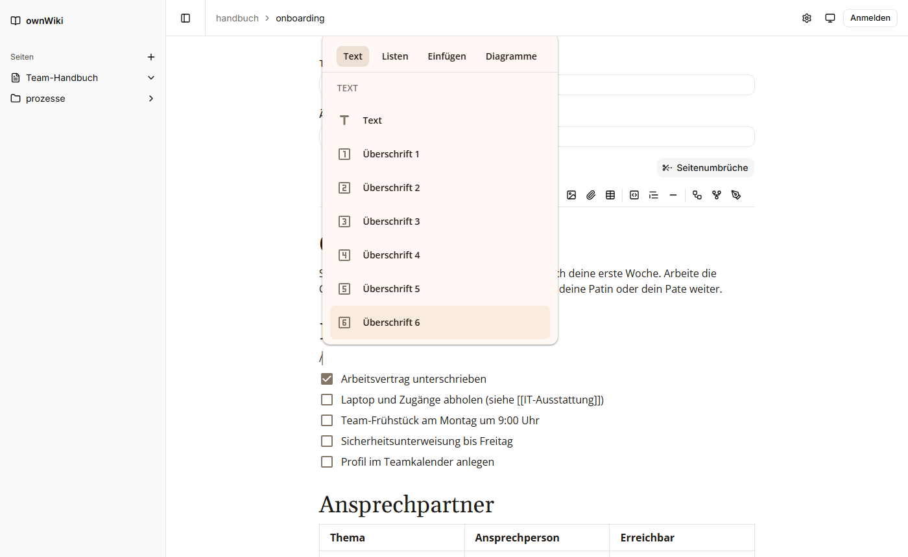

Welche Werkzeuge in der Leiste stehen und in welcher Reihenfolge, stellt jede Person unter **Einstellungen** (Zahnrad oben rechts) selbst ein. Mit Konto wird das im Konto gespeichert, sonst im Browser.

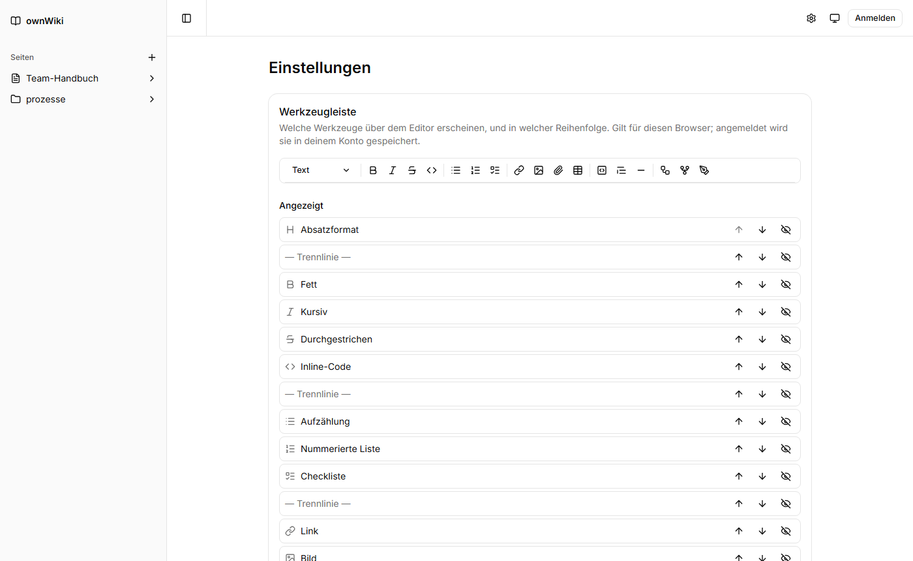

### PDF-Export

„PDF“ auf einer Seite öffnet die Export-Einstellungen: mit Unterseiten (der ganze Bereich), mit Inhaltsverzeichnis und mit eigener Titelseite. „Ganzes Wiki als PDF“ auf der Startseite exportiert alles inklusive Deckblatt. Die Knöpfe einer Seite (PDF, Seitenumbrüche, Verlauf, Bearbeiten) stehen links neben dem Text, in schmalen Fenstern über dem Text.

Die **Titelseite** gestaltest du direkt im Export-Fenster auf einem A4-Blatt – mit dem normalen Editor: Überschrift, Text, Logo oder andere Bilder (Größe an der Ecke ziehen), alles wie auf einer Wiki-Seite. Das Blatt zeigt Ränder und Proportionen wie im PDF; der Inhalt lässt sich waagerecht (links/mittig) und senkrecht (oben/mittig/unten) ausrichten, z. B. für ein Logo in der Seitenmitte. „Ganze Seite“ zeigt das Blatt komplett, „100 %“ in Originalgröße. Passt der Inhalt nicht auf eine Seite, weist das Fenster darauf hin. Die Titelseite wird beim Export mit der Seite gespeichert und ist beim nächsten Mal wieder da; im PDF ersetzt sie das automatische Deckblatt als Seite 1. Ist „Eigene Titelseite“ aus, bleibt das Blatt ausgegraut sichtbar.

Das PDF wird nicht nachgebaut, sondern aus der echten Seite erzeugt: dieselbe Textbreite (A4 mit Rändern), dieselben eingebetteten Schriften, derselbe Editor. Zeilen brechen deshalb an exakt denselben Stellen um. Tabellen und lange Codeblöcke werden zeilenweise auf mehrere Seiten verteilt, der Tabellenkopf wiederholt sich auf jeder Seite.

Jedes PDF hat Lesezeichen für die Seitenleiste des PDF-Betrachters: jede Wiki-Seite mit ihren Abschnitten darunter. Mit dem Haken „Inhaltsverzeichnis“ (im Export-Fenster bzw. auf der Startseite) folgt auf das Deckblatt bzw. die Titelseite außerdem eine gedruckte Inhaltsseite mit Seitenzahlen – Seiten und ihre Überschriften der ersten beiden Ebenen, im PDF anklickbar. Einzelne Seiten bekommen dafür ebenfalls ein Deckblatt, sodass das Verzeichnis immer auf Seite 2 steht. Der Browser merkt sich die Einstellung.

<p align="center">
  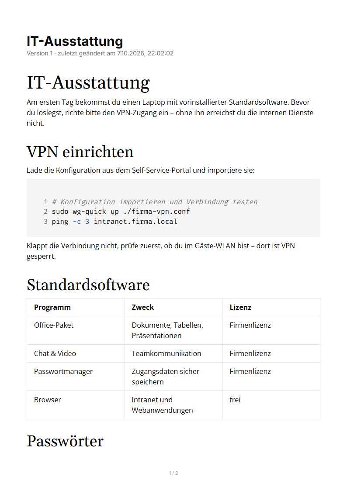
</p>

Damit man schon beim Schreiben sieht, wo eine Seite endet, markiert eine gestrichelte Linie jeden Seitenumbruch – auch mitten in einem Absatz, einer Tabelle oder einem Codeblock. Ein- und ausschalten lässt sie sich über „Seitenumbrüche“.

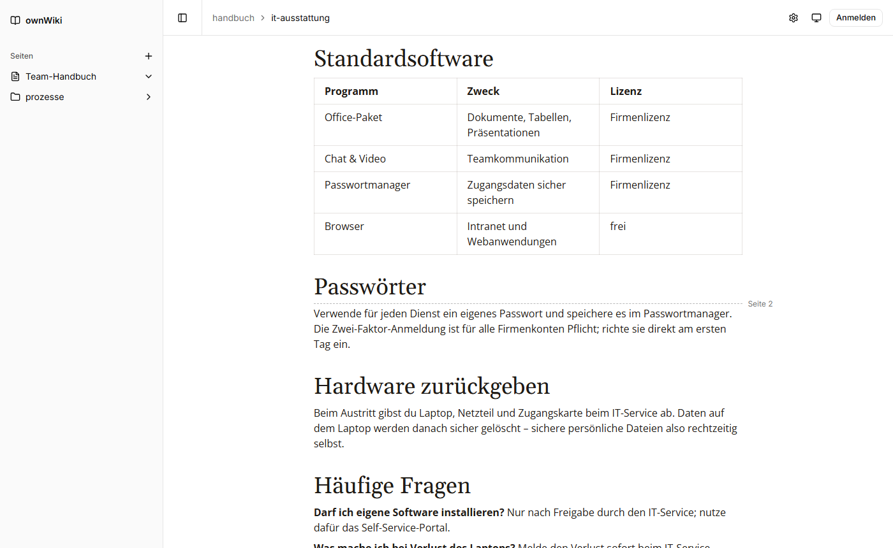

### Diagramme

Diagramme werden über das „/“-Menü (Gruppe „Diagramme“) oder die Werkzeugleiste eingefügt. Sie stehen als Codeblock im Markdown der Seite (` ```mermaid `, ` ```bpmn `, ` ```excalidraw `) – werden also mit der Seite versioniert und landen im PDF. Angezeigt wird die fertige Grafik:

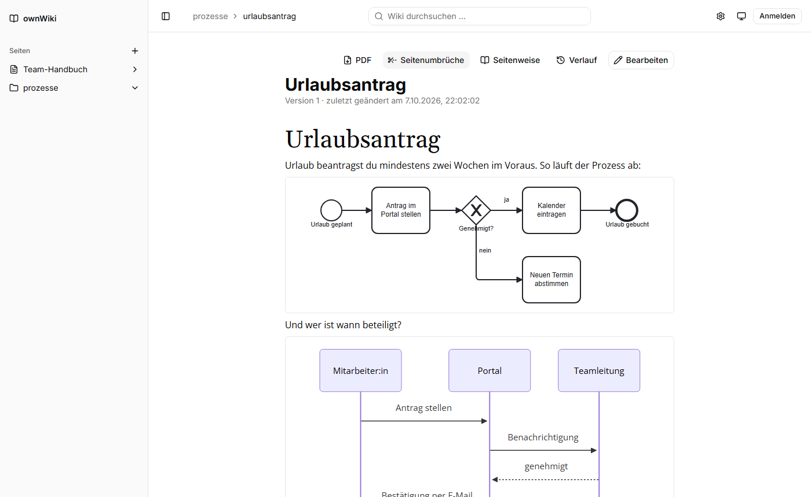

„Bearbeiten“ an einem Diagramm öffnet den passenden Editor groß im Dialog: Mermaid-Code mit Live-Vorschau, den bpmn-js-Modeler oder die Excalidraw-Zeichenfläche.

| BPMN                                                       | Excalidraw                                                             |
| ---------------------------------------------------------- | ---------------------------------------------------------------------- |
| 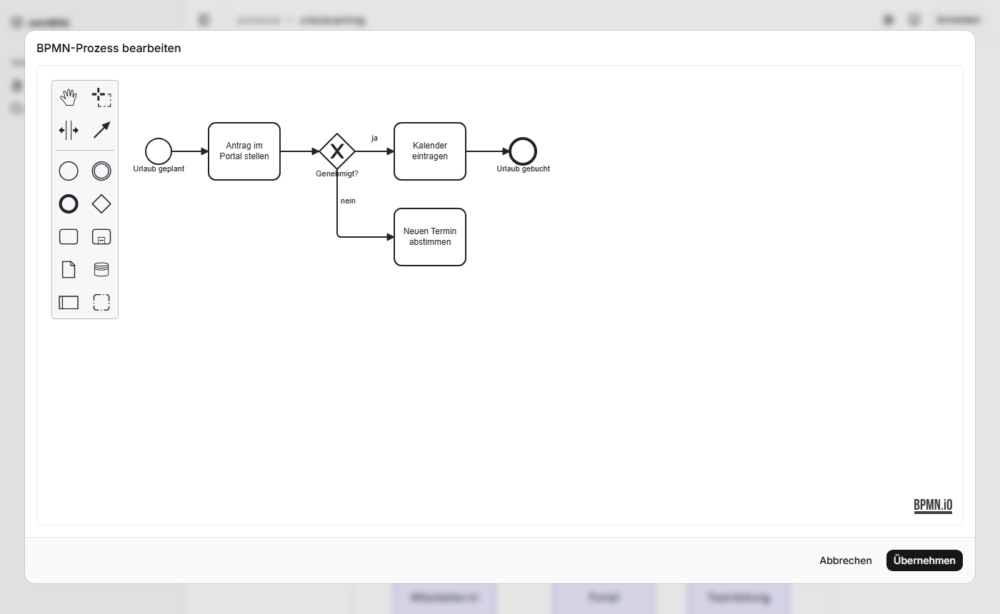 | 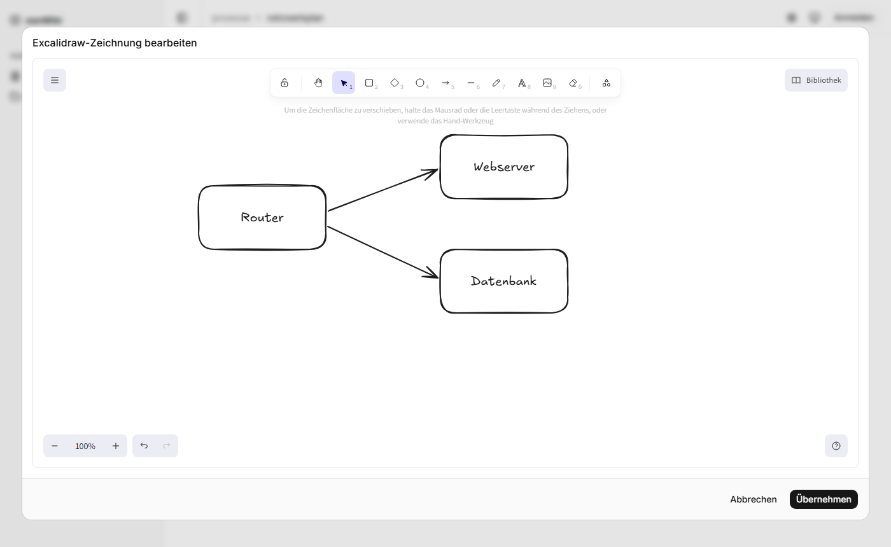 |

Alle Diagramm-Bibliotheken – auch die Schriften von Excalidraw – liefert der eigene Server aus; es werden keine externen Dienste angefragt. Geladen werden sie erst, wenn eine Seite sie braucht.

### Dateien

„Datei“ im „/“-Menü oder in der Werkzeugleiste lädt eine oder mehrere Dateien hoch (je bis 10 MB) und fügt sie als Download-Link an der Cursor-Stelle ein. Bilder, die im Text erscheinen sollen, fügst du über „Bild“ ein. Dateien, die im Text nicht (mehr) verlinkt sind, listet die Bearbeiten-Ansicht auf – zum erneuten Einfügen oder endgültigen Löschen.

### Suche

Das Suchfeld oben in der Mitte durchsucht Titel, Pfade und Text aller Seiten (Diagramm-Quelltexte nicht). Treffer sind nach Relevanz sortiert – Treffer im Titel zählen mehr –, die gefundenen Wörter sind im Textausschnitt markiert. Es müssen alle Suchwörter vorkommen; andere Formen eines Wortes werden mitgefunden („Kündigungen“ findet „Kündigung“).

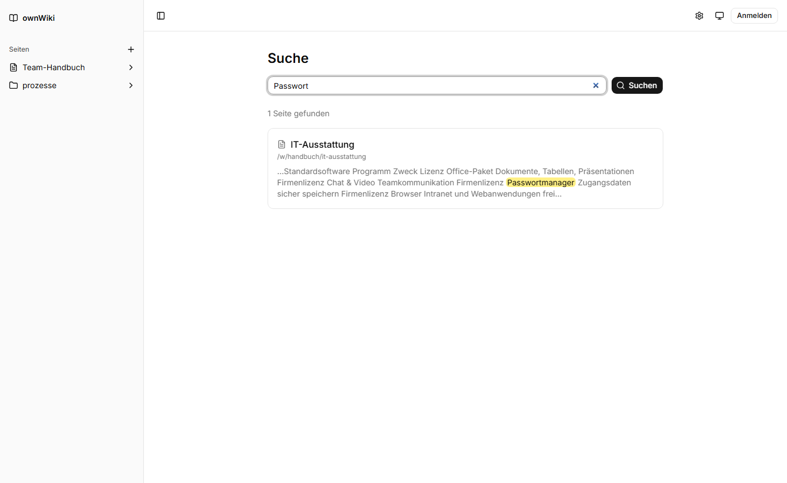

Unter SQLite sucht ownWiki mit FTS5, unter PostgreSQL mit der deutschen Volltextsuche der Datenbank (mit echter Wortstamm-Erkennung). Der Suchindex wird bei jedem Speichern aktualisiert und beim ersten Start automatisch aufgebaut.

### Versionsverlauf

Jedes Speichern legt eine neue Version an, optional mit Änderungshinweis. Im Verlauf lässt sich jede Version ansehen und wiederherstellen.

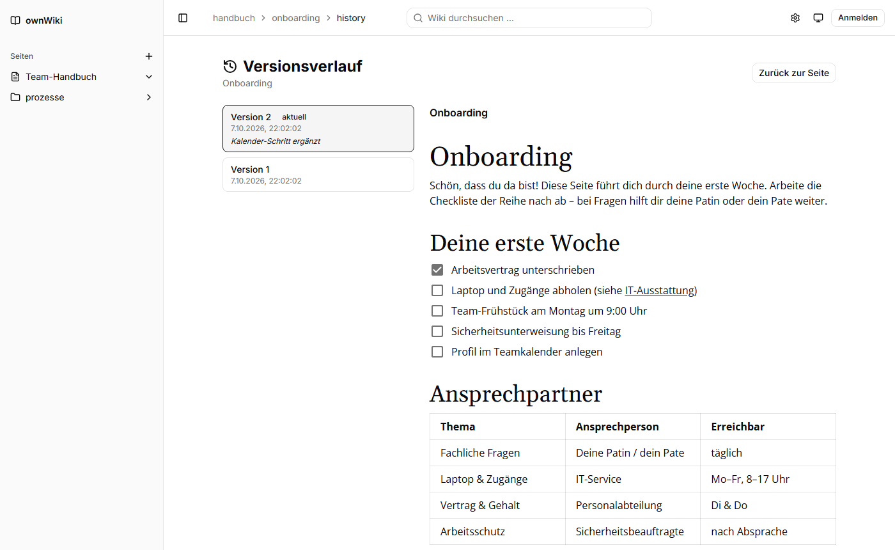

### Dunkelmodus

Über das Symbol oben rechts wählst du hell, dunkel oder die Systemeinstellung. Diagramme bleiben auf weißem Grund, damit sie genauso aussehen wie im (immer hellen) PDF.

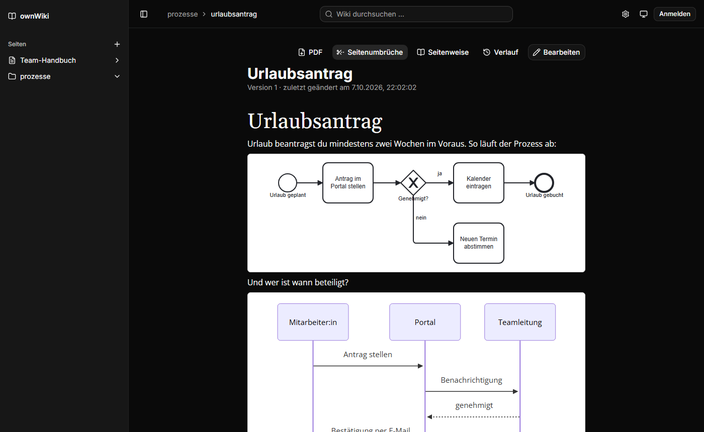

## Schnellstart mit Docker

```sh
cp .env.example .env
# In .env mindestens setzen:
#   BETTER_AUTH_SECRET – zufälliger Wert, z. B. aus: openssl rand -base64 32
#   ORIGIN            – die Adresse, unter der das Wiki erreichbar ist, z. B. http://localhost:3000
docker compose up -d
```

Das Wiki läuft dann auf Port 3000. Die Datenbank (SQLite) liegt im Docker-Volume `wikidata`; Migrationen laufen beim Start automatisch. Für PostgreSQL in `.env` `DATABASE_DIALECT=postgresql` und die passende `DATABASE_URL` setzen und mit `docker compose --profile postgresql up -d` starten.

Das Image enthält Chromium für den PDF-Export.

## Konfiguration

| Variable             | Bedeutung                                                                                  |
| -------------------- | ------------------------------------------------------------------------------------------ |
| `DATABASE_DIALECT`   | `sqlite` (Standard) oder `postgresql`                                                      |
| `DATABASE_URL`       | SQLite: Pfad zur Datei, z. B. `./data/wiki.db` · PostgreSQL: Verbindungs-URL               |
| `ORIGIN`             | Öffentliche Adresse des Wikis. Wird für Anmeldung und für absolute Links im PDF verwendet. |
| `BETTER_AUTH_SECRET` | Geheimer Schlüssel für Sitzungen (mindestens 32 Zeichen)                                   |
| `AUTH_MODE`          | Wer was darf, siehe unten. Standard: `read-only`                                           |
| `ALLOW_SIGNUP`       | Wer ein Konto anlegen darf, siehe unten. Standard: nur das erste Konto                     |
| `PORT`               | Port des Servers, Standard `3000`                                                          |
| `ADDRESS_HEADER`     | Hinter einem Reverse-Proxy: Header mit der echten Client-IP, z. B. `X-Forwarded-For`       |

**Zugriffsmodi (`AUTH_MODE`):**

- `disabled` – ohne Anmeldung: alle dürfen lesen und schreiben.
- `read-only` – alle dürfen lesen, Bearbeiten erfordert eine Anmeldung.
- `full` – ohne Anmeldung kein Zugriff (privates Wiki).

**Registrierung (`ALLOW_SIGNUP`):**

- nicht gesetzt (Standard) – nur das erste Konto kann sich registrieren, danach ist die Registrierung geschlossen.
- `true` – alle dürfen sich registrieren.
- `false` – niemand darf sich registrieren.

Bei `AUTH_MODE=full` sollte die Registrierung geschlossen bleiben, sonst kann sich jede Person selbst Zugang zum privaten Wiki verschaffen.

## Entwicklung

Voraussetzung: Node.js 24.

```sh
npm install
cp .env.example .env     # BETTER_AUTH_SECRET und ORIGIN=http://localhost:5173 setzen
npm run db:push          # Datenbankschema anlegen bzw. aktualisieren
npx playwright install chromium   # einmalig, für den PDF-Export
npm run dev
```

| Befehl                            | Zweck                                                                                                                  |
| --------------------------------- | ---------------------------------------------------------------------------------------------------------------------- |
| `npm run dev`                     | Entwicklungsserver auf http://localhost:5173                                                                           |
| `npm run check`                   | Typprüfung (svelte-check)                                                                                              |
| `npm run lint` / `npm run format` | Prettier und ESLint                                                                                                    |
| `npm run test:unit`               | Unit-Tests mit Vitest                                                                                                  |
| `npm run test:e2e`                | Ende-zu-Ende-Tests mit Playwright                                                                                      |
| `npm run build`                   | Produktions-Build (`node build` startet ihn)                                                                           |
| `npm run db:generate`             | Migration aus Schemaänderungen erzeugen (für SQLite und PostgreSQL jeweils mit passendem `DATABASE_DIALECT` ausführen) |

Die Ende-zu-Ende-Tests bauen die App und starten sie wie im Docker-Image (`node build`), mit einer eigenen, jedes Mal neu befüllten Datenbank unter `.data/e2e/` – die Entwicklungsdatenbank bleibt unberührt. Sie prüfen unter anderem, dass Web-Ansicht und PDF an denselben Stellen umbrechen, dass keine leeren Seiten entstehen und dass die Seitenumbruch-Linien mit dem echten PDF übereinstimmen.

Bei jedem Pull Request und jedem Push auf `main` laufen Lint, Typprüfung, Unit- und Ende-zu-Ende-Tests sowie der Docker-Build in GitHub Actions (`.github/workflows/ci.yml`).

### Aufbau

- **SvelteKit** (Svelte 5) mit **shadcn-svelte** und Tailwind CSS
- **Drizzle ORM** für SQLite und PostgreSQL (`src/lib/server/db`, Repositories in `src/lib/server/repo`)
- **Better Auth** für Konten; die Zugriffsmodi setzt `src/hooks.server.ts` durch
- **Milkdown Crepe** als Editor (`src/lib/components/wiki/markdown-editor.svelte`)
- **PDF-Export**: Die Route `/print/…` rendert die Seiten mit dem echten Editor, [pagedjs](https://pagedjs.org) teilt sie in A4-Seiten auf, und ein Chromium (Playwright) auf dem Server druckt das Ergebnis als PDF (`src/lib/server/pdf`, `src/lib/paginate.ts`). Die Seitenumbruch-Vorschau führt dieselbe Aufteilung unsichtbar im Browser aus (`src/lib/page-breaks.ts`).
- Dateien liegen als BLOB in der Datenbank und werden über `/api/files/[id]` ausgeliefert.

## Noch nicht umgesetzt

- Semantische Suche (KI/Vektor-Embeddings) – die Suche ist dafür als austauschbarer Baustein angelegt (`src/lib/server/search`)
- Speicherung von Dateien in S3-kompatiblem Speicher (z. B. MinIO) statt in der Datenbank
