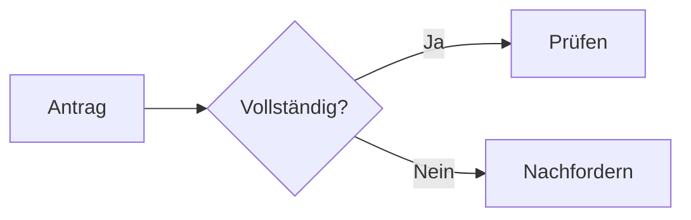

# Diagramme

Ein Ablauf:



Der Prozess:

```bpmn
<?xml version="1.0" encoding="UTF-8"?>
<bpmn:definitions xmlns:bpmn="http://www.omg.org/spec/BPMN/20100524/MODEL" xmlns:bpmndi="http://www.omg.org/spec/BPMN/20100524/DI" xmlns:dc="http://www.omg.org/spec/DD/20100524/DC" xmlns:di="http://www.omg.org/spec/DD/20100524/DI" id="D1" targetNamespace="http://bpmn.io/schema/bpmn">
  <bpmn:process id="P1" isExecutable="false">
    <bpmn:startEvent id="S" name="Antrag eingegangen"><bpmn:outgoing>F1</bpmn:outgoing></bpmn:startEvent>
    <bpmn:task id="T" name="Antrag prüfen"><bpmn:incoming>F1</bpmn:incoming><bpmn:outgoing>F2</bpmn:outgoing></bpmn:task>
    <bpmn:endEvent id="E" name="Erledigt"><bpmn:incoming>F2</bpmn:incoming></bpmn:endEvent>
    <bpmn:sequenceFlow id="F1" sourceRef="S" targetRef="T" />
    <bpmn:sequenceFlow id="F2" sourceRef="T" targetRef="E" />
  </bpmn:process>
  <bpmndi:BPMNDiagram id="BD"><bpmndi:BPMNPlane id="BP" bpmnElement="P1">
    <bpmndi:BPMNShape id="S_di" bpmnElement="S"><dc:Bounds x="152" y="102" width="36" height="36" /></bpmndi:BPMNShape>
    <bpmndi:BPMNShape id="T_di" bpmnElement="T"><dc:Bounds x="240" y="80" width="100" height="80" /></bpmndi:BPMNShape>
    <bpmndi:BPMNShape id="E_di" bpmnElement="E"><dc:Bounds x="392" y="102" width="36" height="36" /></bpmndi:BPMNShape>
    <bpmndi:BPMNEdge id="F1_di" bpmnElement="F1"><di:waypoint x="188" y="120" /><di:waypoint x="240" y="120" /></bpmndi:BPMNEdge>
    <bpmndi:BPMNEdge id="F2_di" bpmnElement="F2"><di:waypoint x="340" y="120" /><di:waypoint x="392" y="120" /></bpmndi:BPMNEdge>
  </bpmndi:BPMNPlane></bpmndi:BPMNDiagram>
</bpmn:definitions>
```

Ende.
